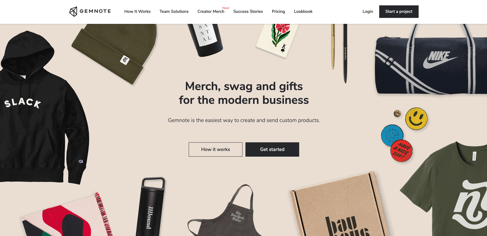

## Introduction

Creating a merchandise shop using WordPress might appear straightforward given the platform's user-friendly interface. However, building a shop that is both functional and competitive requires a structured approach that orchestrates several key components.

## Preliminary Decisions: Niche and Products

Before even opening the WordPress dashboard, we identified our target niche and the kind of merchandise to offer. Comprehensive market research was invaluable for gaining insights into consumer demands and existing market gaps. Eventually, we focused on a specific genre of apparel and accessories.

## Platform Setup: WordPress Installation

Armed with a clear plan, the next task involved setting up WordPress. Although the initial installation is generally straightforward, optimizing settings for eCommerce demands extra care. We chose a reliable hosting service, took into consideration uptime and loading speed, and installed the WordPress CMS.

## Design and Layout: Theme and Plugins

Choosing a theme went beyond mere aesthetics; it also had to be mobile-responsive and compatible with WooCommerce, the plugin suite that enables eCommerce functionalities. Customizations were made to align the theme with our brand identity, and additional plugins were installed to improve SEO and site security.

## Inventory and Backend: WooCommerce Configuration

WooCommerce needed to be configured for effective inventory management. We created categories and listed each product with relevant attributes like size, color, and price. Additionally, secure payment gateways were integrated to ensure transactional integrity.

## User Experience: Navigation and Checkout

Efficient user experience was a priority. Product categories had to be easily navigable, and the checkout process needed to be both simple and secure. This involved testing the site's user flow and making adjustments as necessary.

## Marketing and SEO: Visibility and Traffic

Launching the shop was only half the battle. Visibility is crucial; without it, even the best-stocked and beautifully designed shop would fail. We implemented a foundational SEO strategy, focusing on keywords and meta descriptions, and initiated advertising campaigns to drive initial traffic.

## Analytics and Monitoring: Gauging Success

Post-launch, we utilized built-in analytics tools to track various performance metrics like visitor count, conversion rates, and average time spent on the site. This data was invaluable for refining both the shop and its marketing strategies.

## Summary and Takeaways

The project was intricate, involving numerous steps from conceptualization to operation. However, these complexities were not setbacks but rather crucial steps towards achieving our end goal. Our shop became not just a functional eCommerce platform but also an optimized vehicle for sustained growth.

This project underscored the complexities of online commerce, demonstrating that a successful venture requires a well-rounded combination of planning, technical skills, and strategic marketing.
